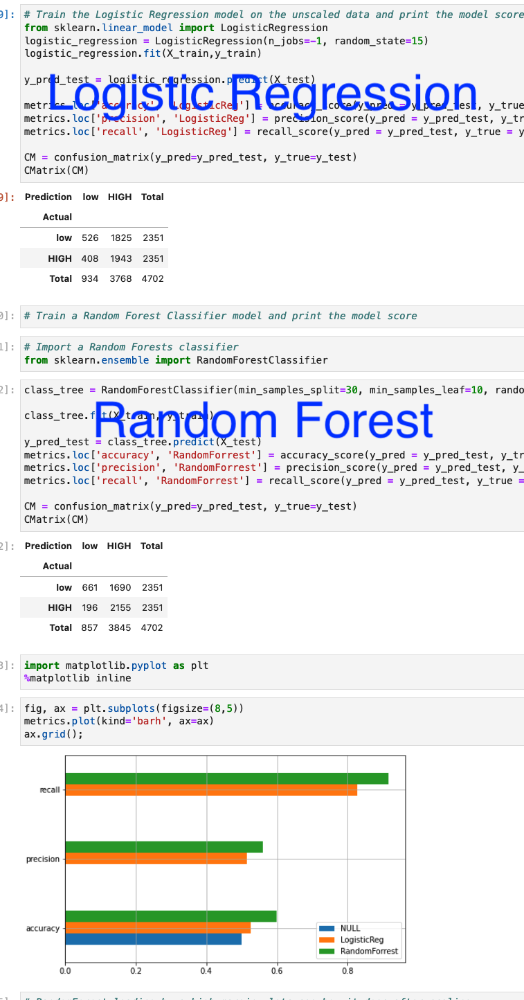

# Predicting Credit Risk for LendingClub Applicants
# Supervised Machine Learning

Predict whether a loan from [The LendingClub](https://resources.lendingclub.com/](https://resources.lendingclub.com/) will become **_high risk_** or not. 

># Background

[The LendingClub](https://resources.lendingclub.com/](https://resources.lendingclub.com/) is a peer-to-peer lending services company that allows individual investors to partially fund personal loans as well as buy and sell notes backing the loans on a secondary market. [The LendingClub](https://resources.lendingclub.com/](https://resources.lendingclub.com/) offers their previous data through an API.

This machine learning model will classify the risk level of a given loan based on the column `loan_status`'s output which could be one of the following:
* low_risk
* high_risk

Specifically, I will be comparing a `Logistic Regression model` and a `Random Forest Classifier`.

># Instructions

### Retrieve the data

In the `Generator` folder in `Resources`, there is a [GenerateData.ipynb](/Resources/Generator/GenerateData.ipynb) notebook that will download data from LendingClub as zip files in the current directory then extract the data, then clean the data: 
* drop NaN rows/columns
* convert types
* rename values in target column
* concatenate dataframes

..then compress and extract the cleaned csv up a directory. 

Using an entire year's worth of data [2019loans.csv](/Resources/2019loans.csv), we predict the credit risk of loans from the first quarter of the next year [2020Q1loans.csv](/Resources/2020Q1loans.csv).

- **_Note: these two CSVs have been undersampled to give an even number of high risk and low risk loans. In the original dataset, only 2.2% of loans are categorized as high risk. To get a truly accurate model, special techniques need to be used on imbalanced data. Undersampling is one of those techniques. Oversampling and SMOTE (Synthetic Minority Over-sampling Technique) are other techniques that are also used._**

### Preprocessing: Convert categorical data to numeric

Moving on to [Credit_Risk_Models.ipynb](Credit_Risk_Models.ipynb) I encoded our training sets `X_train` and `y_train` from the 2019 loans using `pd.get_dummies()` to convert the categorical data to numeric columns. Repeated this step for `X_test` and `y_test`.

- **_Note There was a missing category in the 2019 csv that did not exist in the testing set. If you fit a model to the training set and try to score it on the testing set as is, you will get an error. I had to fill in the missing category in the testing set but since I already encoded it all i had to do was inject the associated column and fill it with 0's as values._**

## Considering the models

I compared two models on this data: a **logistic regression** model, and a **random forests classifier** model. 
I want to see what the results will look like using the data _as is_ as much as possible so I will run it before I scale it.
I am pretty sure that the difference will be significant for both models, however, **I predicted that the `random forest classifier` would have the better results overall** (I was right lol)

## Fitting a LogisticRegression model and RandomForestClassifier model
Below we can see the confusion matrix for each model followed by a horizontal bar chart comparing each model's performance.
Both of these models performed heavy in recall (which is kinda what we hoped for lol) but the biased trade off is too significant to even consider this method (_unscaling data_). The reason I say that is because although not many high risk loans will be distrubuted, the actual low risk loans are not doing well either. With the data in it's current state, both models will be high_risk biased (not good). The Random Forest Classifier is still the better model even though its giving out less loans overall (LR = 934, RF = 857), it is still better at correctly identifying high risk loans as high risk loans (LR = 408, RF 196)

## Revisit Preprocessing: Scale the data

The data going into these models was never scaled and this is an important step in preprocessing. I used the `RobustScaler` function to scale the training and testing sets before re-fitting them to the `Logistic Regression` and `Random Forest Classifier` models.
Amazing improvements to say the least for both models. Although we decreased recall, precision and overall accuracy improved drastically.
More true negatives (low risk predicted as low risk) and more true positives (high risk predicted as high risk) for both models.
My prediction was correct, the Random Forest Classifier was the better model overall.

### References

_Loan Stats_. Retrieved from: [LendingClub (2019-2020)](https://resources.lendingclub.com/](https://resources.lendingclub.com/)

Check my future machine learning repo's where I will go further into hypertunning parameters, use different models, and use different styles of visualizations.
# Thanks!
